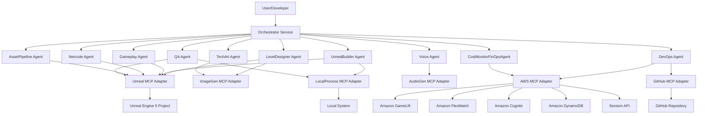

# Design Document: Unreal VR Multiplayer System

## Overview

The Unreal VR Multiplayer System is a sophisticated multi-agent architecture that transforms natural language specifications into fully deployed VR multiplayer experiences. The system operates on a spec-driven philosophy where all state changes are captured in versioned specification documents, enabling reproducibility, auditability, and collaborative development.

The architecture consists of three primary layers:

1. **Orchestration Layer**: A local-first orchestrator that manages the plan→execute workflow, coordinating multiple specialized agents
2. **Agent Layer**: Ten specialized agents, each responsible for a specific domain (level design, Unreal Engine integration, networking, voice, assets, QA, DevOps, cost monitoring)
3. **Infrastructure Layer**: AWS-based backend services (GameLift, FlexMatch, Cognito, DynamoDB) with full mock support for local development

The system prioritizes a complete vertical slice implementation: natural language → LevelPlan → Unreal map → GameLift match → gameplay → reward summary with TTL expiration. This ensures all architectural layers are validated early and integration points are proven before expanding features.

## Architecture

### System Components



### Orchestrator Architecture

The Orchestrator implements a two-phase workflow:

**Plan Phase:**
1. Accept natural language specification from user
2. Analyze requirements and determine which agents are needed
3. Generate a structured execution plan with dependencies
4. Present plan to user for review and approval

**Execute Phase:**
1. Execute approved plan steps in dependency order
2. Coordinate agent interactions and data flow
3. Update specification documents with change notes
4. Report progress and handle errors
5. Generate final summary with provenance records

The Orchestrator maintains a state machine tracking plan execution and can pause, resume, or rollback operations based on agent feedback or user intervention.

### Agent Specialization

Each agent is responsible for a specific domain and communicates through structured JSON messages:

- **LevelDesigner**: Converts natural language to LevelPlan schema, generates spatial layouts, defines gameplay zones
- **UnrealBuilder**: Manages Unreal Engine project structure, builds for Quest 3, packages server and client binaries
- **Gameplay**: Implements gameplay rules, player interactions, win conditions, reward triggers
- **Netcode**: Implements server-authoritative networking, replication, client prediction, lag compensation
- **Voice**: Integrates voice provider, manages party voice channels, handles audio routing
- **TechArt**: Generates placeholder assets from concept art, optimizes materials for Quest 3, manages LODs
- **AssetPipeline**: Imports assets, validates provenance, manages asset registry, tracks licensing
- **QA**: Generates test scenarios, runs automated tests, validates VR comfort settings, reports issues
- **DevOps**: Manages infrastructure deployment, CI/CD pipelines, environment configuration
- **CostMonitorFinOpsAgent**: Tracks AWS costs, enforces budget policies, generates cost reports, prevents overruns

### MCP Adapter Pattern

All external system interactions go through MCP adapters, which provide:

1. **Capability-based interface**: Agents request capabilities (e.g., "build_unreal_project") rather than direct API calls
2. **Mock support**: Every adapter has a mock implementation for local development
3. **Provenance tracking**: All operations are logged with timestamps and actor information
4. **Error handling**: Consistent error reporting across all external systems
5. **Rate limiting**: Prevents excessive API calls and cost overruns

## Components and Interfaces

### Core Schemas

#### LevelPlan Schema

```json
{
  "$schema": "http://json-schema.org/draft-07/schema#",
  "type": "object",
  "required": ["id", "name", "description", "zones", "playerSpawns", "objectives"],
  "properties": {
    "id": {"type": "string", "format": "uuid"},
    "name": {"type": "string"},
    "description": {"type": "string"},
    "zones": {
      "type": "array",
      "items": {
        "type": "object",
        "required": ["id", "name", "bounds", "type"],
        "properties": {
          "id": {"type": "string"},
          "name": {"type": "string"},
          "bounds": {
            "type": "object",
            "required": ["center", "extents"],
            "properties": {
              "center": {"type": "object", "required": ["x", "y", "z"]},
              "extents": {"type": "object", "required": ["x", "y", "z"]}
            }
          },
          "type": {"type": "string", "enum": ["combat", "safe", "objective", "spawn"]},
          "assets": {"type": "array", "items": {"type": "string"}}
        }
      }
    },
    "playerSpawns": {
      "type": "array",
      "items": {
        "type": "object",
        "required": ["position", "rotation"],
        "properties": {
          "position": {"type": "object", "required": ["x", "y", "z"]},
          "rotation": {"type": "object", "required": ["pitch", "yaw", "roll"}}
        }
      }
    },
    "objectives": {
      "type": "array",
      "items": {
        "type": "object",
        "required": ["id", "type", "description"],
        "properties": {
          "id": {"type": "string"},
          "type": {"type": "string"},
          "description": {"type": "string"},
          "rewardId": {"type": "string"}
        }
      }
    }
  }
}
```

#### GameplayRules Schema

```json
{
  "$schema": "http://json-schema.org/draft-07/schema#",
  "type": "object",
  "required": ["id", "levelId", "rules"],
  "properties": {
    "id": {"type": "string", "format": "uuid"},
    "levelId": {"type": "string", "format": "uuid"},
    "rules": {
      "type": "array",
      "items": {
        "type": "object",
        "required": ["id", "trigger", "action"],
        "properties": {
          "id": {"type": "string"},
          "trigger": {
            "type": "object",
            "required": ["type", "conditions"],
            "properties": {
              "type": {"type": "string"},
              "conditions": {"type": "object"}
            }
          },
          "action": {
            "type": "object",
            "required": ["type", "parameters"],
            "properties": {
              "type": {"type": "string"},
              "parameters": {"type": "object"}
            }
          }
        }
      }
    }
  }
}
```

#### AssetSpec Schema

```json
{
  "$schema": "http://json-schema.org/draft-07/schema#",
  "type": "object",
  "required": ["id", "name", "tier", "provenance"],
  "properties": {
    "id": {"type": "string", "format": "uuid"},
    "name": {"type": "string"},
    "tier": {"type": "integer", "enum": [0, 1, 2]},
    "type": {"type": "string", "enum": ["mesh", "texture", "material", "sound", "animation"]},
    "provenance": {
      "type": "object",
      "required": ["origin", "license", "createdAt", "createdBy"],
      "properties": {
        "origin": {"type": "string", "enum": ["generated", "hand-crafted", "licensed", "marketplace"]},
        "license": {"type": "string"},
        "licenseUrl": {"type": "string", "format": "uri"},
        "createdAt": {"type": "string", "format": "date-time"},
        "createdBy": {"type": "string"},
        "sourceUrl": {"type": "string", "format": "uri"},
        "cost": {"type": "number", "minimum": 0}
      }
    },
    "unrealPath": {"type": "string"},
    "metadata": {"type": "object"}
  }
}
```

#### BudgetPolicy Schema

```json
{
  "$schema": "http://json-schema.org/draft-07/schema#",
  "type": "object",
  "required": ["id", "environment", "limits", "enforcement"],
  "properties": {
    "id": {"type": "string", "format": "uuid"},
    "environment": {"type": "string", "enum": ["dev", "prod"]},
    "limits": {
      "type": "object",
      "required": ["total", "duration"],
      "properties": {
        "total": {"type": "number", "minimum": 0},
        "currency": {"type": "string", "default": "GBP"},
        "duration": {"type": "string", "pattern": "^\\d+h$"},
        "perService": {
          "type": "object",
          "properties": {
            "gamelift": {"type": "number"},
            "cognito": {"type": "number"},
            "dynamodb": {"type": "number"},
            "lambda": {"type": "number"},
            "other": {"type": "number"}
          }
        }
      }
    },
    "enforcement": {
      "type": "object",
      "required": ["mode"],
      "properties": {
        "mode": {"type": "string", "enum": ["report", "warn", "block"]},
        "warningThreshold": {"type": "number", "minimum": 0, "maximum": 1},
        "approvalRequired": {"type": "boolean"}
      }
    }
  }
}
```

#### Rewards Catalog Schema

```json
{
  "$schema": "http://json-schema.org/draft-07/schema#",
  "type": "object",
  "required": ["version", "rewards"],
  "properties": {
    "version": {"type": "string"},
    "rewards": {
      "type": "array",
      "items": {
        "type": "object",
        "required": ["id", "name", "description"],
        "properties": {
          "id": {"type": "string"},
          "name": {"type": "string"},
          "description": {"type": "string"},
          "category": {"type": "string"}
        }
      }
    }
  }
}
```

### Agent Communication Protocol

Agents communicate through a standardized message protocol:

```typescript
interface AgentMessage {
  id: string;
  timestamp: string;
  from: string;
  to: string;
  type: 'request' | 'response' | 'event' | 'error';
  payload: any;
  correlationId?: string;
}

interface AgentRequest extends AgentMessage {
  type: 'request';
  payload: {
    capability: string;
    parameters: Record<string, any>;
    timeout?: number;
  };
}

interface AgentResponse extends AgentMessage {
  type: 'response';
  payload: {
    success: boolean;
    result?: any;
    error?: {
      code: string;
      message: string;
      details?: any;
    };
  };
}
```

### Orchestrator API

The Orchestrator exposes a local HTTP API for user interaction:

```typescript
// POST /api/v1/plans
interface CreatePlanRequest {
  specification: string; // Natural language
  context?: {
    existingLevels?: string[];
    budgetPolicy?: string; // Path to policy file
    targetEnvironment: 'dev' | 'prod';
  };
}

interface CreatePlanResponse {
  planId: string;
  steps: PlanStep[];
  estimatedCost: number;
  estimatedDuration: string;
}

// POST /api/v1/plans/:planId/execute
interface ExecutePlanRequest {
  approved: boolean;
  modifications?: Partial<PlanStep>[];
}

interface ExecutePlanResponse {
  executionId: string;
  status: 'running' | 'paused' | 'completed' | 'failed';
  progress: {
    completed: number;
    total: number;
    currentStep: string;
  };
}

// GET /api/v1/executions/:executionId
interface ExecutionStatus {
  executionId: string;
  planId: string;
  status: 'running' | 'paused' | 'completed' | 'failed';
  steps: StepStatus[];
  artifacts: Artifact[];
  costs: CostSummary;
}
```

## Data Models

### Session Data Model

Sessions are ephemeral with TTL-based expiration:

```typescript
interface PlayerSession {
  sessionId: string;
  playerId: string;
  shardId: string;
  startTime: string;
  endTime?: string;
  events: InteractionEvent[];
  rewards: string[]; // Reward IDs from catalog
  ttl: number; // Unix timestamp for DynamoDB TTL
}

interface InteractionEvent {
  eventId: string;
  timestamp: string;
  playerId: string;
  eventType: string;
  data: Record<string, any>;
  ttl: number; // Unix timestamp for DynamoDB TTL
}
```

DynamoDB table structure:

- **PlayerSessions** table: Partition key = `playerId`, Sort key = `sessionId`, TTL attribute = `ttl`
- **InteractionEvents** table: Partition key = `sessionId`, Sort key = `timestamp`, TTL attribute = `ttl`
- **PlayerRewards** table: Partition key = `playerId`, Sort key = `rewardId` (no TTL - persistent)

### Provenance Data Model

All assets maintain complete provenance:

```typescript
interface ProvenanceRecord {
  assetId: string;
  assetName: string;
  origin: 'generated' | 'hand-crafted' | 'licensed' | 'marketplace';
  license: string;
  licenseUrl?: string;
  createdAt: string;
  createdBy: string; // Agent or user
  sourceUrl?: string;
  cost: number;
  currency: string;
  approvedBy?: string;
  approvedAt?: string;
  usageRights: {
    commercial: boolean;
    modification: boolean;
    redistribution: boolean;
  };
  dependencies: string[]; // Other asset IDs
  changeHistory: ProvenanceChange[];
}

interface ProvenanceChange {
  timestamp: string;
  actor: string;
  action: string;
  notes: string;
}
```

### Cost Tracking Model

```typescript
interface CostRecord {
  recordId: string;
  timestamp: string;
  service: string;
  operation: string;
  cost: number;
  currency: string;
  resourceId?: string;
  tags: Record<string, string>;
  budgetPolicyId: string;
}

interface CostSummary {
  budgetPolicyId: string;
  totalCost: number;
  currency: string;
  startTime: string;
  endTime: string;
  byService: Record<string, number>;
  projectedTotal: number;
  remainingBudget: number;
  status: 'ok' | 'warning' | 'exceeded';
}
```

## Correctness Properties

*A property is a characteristic or behavior that should hold true across all valid executions of a system—essentially, a formal statement about what the system should do. Properties serve as the bridge between human-readable specifications and machine-verifiable correctness guarantees.*


### Property Reflection

After analyzing all acceptance criteria, several redundancies were identified:

**Redundancy Group 1 - Configuration Validation:**
- Requirements 1.3, 1.4, 1.5, 1.6, 1.7 all test VR configuration defaults
- These can be combined into a single property testing VR comfort configuration completeness

**Redundancy Group 2 - Authentication:**
- Requirements 3.3 and 3.4 both test JWT validation
- 3.4 (reject invalid tokens) is the inverse of 3.3 (validate valid tokens)
- These can be combined into a single property about JWT validation correctness

**Redundancy Group 3 - Session Cleanup:**
- Requirements 5.1, 5.2, 5.5 all test that only rewards persist after session end
- These are logically equivalent and can be combined into one property

**Redundancy Group 4 - Provenance Completeness:**
- Requirements 6.5 and 6.6 both test provenance record completeness
- 6.6 is more specific than 6.5, so 6.5 is subsumed by 6.6

**Redundancy Group 5 - Production Approval Gates:**
- Requirements 7.2, 7.3, 7.4 all test that prod environment requires approvals
- These can be combined into a single property about approval gate enforcement

**Redundancy Group 6 - Licensed Asset Handling:**
- Requirements 16.1, 16.2, 16.3, 16.4 all test licensed asset workflow
- These can be combined into a comprehensive property about licensed asset handling

**Redundancy Group 7 - Spec Update Requirements:**
- Requirements 17.1 and 17.2 both test spec update behavior
- These can be combined into a single property about spec updates including change notes

**Redundancy Group 8 - Cost Monitoring:**
- Requirements 20.2, 20.3, 20.4, 20.5 all test cost monitoring behavior
- These can be combined into fewer comprehensive properties

After reflection, we'll focus on unique, high-value properties that provide comprehensive validation.

### Core Properties

**Property 1: Server Authority for Gameplay State**

*For any* gameplay state change (player position, health, inventory, score), the change must originate from the dedicated server and be replicated to clients, never accepted directly from client input without server validation.

**Validates: Requirements 2.1**

**Property 2: Shard Player Capacity Enforcement**

*For any* shard, the system must accept player connections up to 15 players and reject any connection attempts beyond that limit.

**Validates: Requirements 2.2**

**Property 3: JWT Token Validation**

*For any* connection attempt with a JWT token, the system must validate the token signature, expiration, and claims, accepting valid tokens and rejecting invalid or expired tokens.

**Validates: Requirements 3.2, 3.3, 3.4**

**Property 4: Party Voice Routing**

*For any* shard with multiple players, each player must receive audio streams from all other players in that shard, and voice must not be affected by player position or distance.

**Validates: Requirements 4.2, 4.5**

**Property 5: Session Ephemeral State**

*For any* completed session, querying the database should return only reward flags for that session, with all gameplay state (positions, events, inventory) absent from persistent storage.

**Validates: Requirements 5.1, 5.2, 5.5**

**Property 6: Reward Catalog Validation**

*For any* reward grant operation, the reward ID must exist in the rewards_catalog.json file, and operations with invalid reward IDs must be rejected with an error.

**Validates: Requirements 5.3, 15.2, 15.3**

**Property 7: Event TTL Assignment**

*For any* interaction event stored in DynamoDB, the record must have a TTL attribute set to a future Unix timestamp, ensuring automatic expiration.

**Validates: Requirements 5.4**

**Property 8: Tier 1 Asset Generation**

*For any* valid 2D concept art input, the TechArt agent must generate a placeholder 3D asset with appropriate geometry, materials, and metadata.

**Validates: Requirements 6.3**

**Property 9: Licensed Asset Recommendation Without Purchase**

*For any* licensed asset identified as suitable, the system must create a recommendation record with licensing details but must not execute any purchase API calls or add the asset to the project without manual approval.

**Validates: Requirements 6.4, 16.1, 16.2, 16.3, 16.4**

**Property 10: Asset Provenance Completeness**

*For any* asset in the system, a provenance record must exist containing origin, license, licenseUrl (if applicable), createdAt, createdBy, and usageRights fields.

**Validates: Requirements 6.5, 6.6**

**Property 11: Environment-Based Approval Gates**

*For any* infrastructure change, deployment, or budget increase operation in production environment, the operation must block and wait for manual approval before proceeding, while the same operations in development environment must proceed autonomously.

**Validates: Requirements 7.1, 7.2, 7.3, 7.4**

**Property 12: Cost Limit Enforcement**

*For any* AWS operation that would cause total costs to exceed the budget policy limit, the CostMonitorFinOpsAgent must block the operation and return a budget exceeded error.

**Validates: Requirements 7.7, 20.4**

**Property 13: MCP Adapter Mock Mode**

*For any* MCP adapter, when mock mode is enabled, all operations must execute locally without making external API calls, and must return realistic simulated responses.

**Validates: Requirements 8.5, 12.7**

**Property 14: Reward Storage Format**

*For any* granted reward, the database record must store the reward as a boolean flag (true) with the reward ID as a string key, and the record must not have a TTL attribute.

**Validates: Requirements 15.4**

**Property 15: Spec Update with Change Notes**

*For any* system state change operation, the corresponding specification document must be updated with a new entry containing timestamp, actor, action, and descriptive change notes.

**Validates: Requirements 17.1, 17.2**

**Property 16: Spec Version History**

*For any* specification document, the system must maintain a retrievable version history showing all previous versions with timestamps and change notes.

**Validates: Requirements 17.3**

**Property 17: Orchestrator Plan Generation**

*For any* valid natural language specification input, the Orchestrator must generate an execution plan containing a list of steps, agent assignments, dependencies, estimated cost, and estimated duration.

**Validates: Requirements 19.2**

**Property 18: Plan Approval Requirement**

*For any* generated execution plan, the Orchestrator must not begin execution until an explicit approval is received, and must present the plan for review first.

**Validates: Requirements 19.4**

**Property 19: Multi-Agent Coordination**

*For any* execution plan requiring multiple agents, the Orchestrator must coordinate agent execution according to dependency order, passing outputs from completed steps as inputs to dependent steps.

**Validates: Requirements 19.5**

**Property 20: Cost Tracking for AWS Operations**

*For any* AWS operation executed through MCP adapters, the CostMonitorFinOpsAgent must create a cost record containing service, operation, cost estimate, timestamp, and resource ID.

**Validates: Requirements 20.2**

**Property 21: Budget Warning Threshold**

*For any* budget policy with a warning threshold, when accumulated costs reach the threshold percentage, the CostMonitorFinOpsAgent must generate a warning event and notify relevant stakeholders.

**Validates: Requirements 20.3**

**Property 22: Cost Report Generation**

*For any* completed operation or time period, the CostMonitorFinOpsAgent must generate a cost summary report containing total cost, breakdown by service, projected total, and remaining budget.

**Validates: Requirements 20.5**

## Error Handling

### Error Categories

The system defines four error severity levels:

1. **Critical**: System cannot continue, requires immediate intervention (e.g., budget exceeded, authentication failure)
2. **Error**: Operation failed but system can continue (e.g., asset generation failed, single agent timeout)
3. **Warning**: Potential issue detected (e.g., approaching budget limit, slow response time)
4. **Info**: Informational message (e.g., operation completed, plan generated)

### Error Handling Strategies

**Orchestrator Errors:**
- Plan generation failure → Return error to user with details, do not attempt execution
- Agent timeout → Mark step as failed, pause execution, request user intervention
- Agent error → Retry up to 3 times with exponential backoff, then pause execution
- Dependency failure → Skip dependent steps, mark as blocked, continue with independent steps

**Agent Errors:**
- MCP adapter failure → Return error to orchestrator with details, do not retry automatically
- Validation failure → Return validation errors to orchestrator, suggest corrections
- Resource unavailable → Return error with retry suggestion and estimated wait time
- Cost limit exceeded → Return budget error, block operation, notify user

**Infrastructure Errors:**
- GameLift fleet unavailable → Use mock mode if in dev, block if in prod, notify DevOps agent
- Cognito authentication failure → Reject connection, log security event, return auth error
- DynamoDB throttling → Implement exponential backoff, reduce request rate, notify CostMonitor
- Network timeout → Retry with exponential backoff up to 3 attempts, then fail

**Asset Pipeline Errors:**
- Invalid asset format → Return validation error with format requirements
- Provenance missing → Block asset import, request provenance information
- License violation detected → Block asset usage, notify user, log compliance event
- Generation failure → Fall back to lower tier (Tier 1 → Tier 0), notify TechArt agent

### Error Recovery

**Automatic Recovery:**
- Transient network errors: Retry with exponential backoff
- Rate limiting: Implement backoff and reduce request rate
- Resource temporarily unavailable: Queue operation and retry later

**Manual Recovery:**
- Budget exceeded: Requires budget policy update and approval
- Authentication failure: Requires credential refresh
- License violation: Requires asset removal and replacement
- Critical infrastructure failure: Requires DevOps intervention

**Rollback Procedures:**
- Failed deployment: Terraform rollback to previous state
- Failed plan execution: Revert spec changes, restore previous version
- Failed asset import: Remove partial assets, clean up references

## Testing Strategy

### Dual Testing Approach

The system requires both unit testing and property-based testing for comprehensive coverage:

**Unit Tests:**
- Specific examples demonstrating correct behavior
- Edge cases (empty inputs, boundary values, special characters)
- Error conditions (invalid tokens, missing files, network failures)
- Integration points between components
- Mock adapter behavior verification

**Property-Based Tests:**
- Universal properties across all inputs (see Correctness Properties section)
- Randomized input generation for comprehensive coverage
- Minimum 100 iterations per property test
- Each test tagged with: **Feature: unreal-vr-multiplayer-system, Property N: [property text]**

### Property-Based Testing Configuration

**Framework Selection:**
- **TypeScript/JavaScript**: fast-check library
- **Python**: Hypothesis library
- **C++ (Unreal)**: RapidCheck library

**Test Configuration:**
```typescript
// Example property test configuration
import fc from 'fast-check';

describe('Feature: unreal-vr-multiplayer-system', () => {
  it('Property 6: Reward Catalog Validation', () => {
    fc.assert(
      fc.property(
        fc.string(), // Random reward ID
        (rewardId) => {
          const catalog = loadRewardsCatalog();
          const result = grantReward(playerId, rewardId);
          
          if (catalog.rewards.some(r => r.id === rewardId)) {
            expect(result.success).toBe(true);
          } else {
            expect(result.success).toBe(false);
            expect(result.error.code).toBe('INVALID_REWARD_ID');
          }
        }
      ),
      { numRuns: 100 }
    );
  });
});
```

### Test Organization

**Unit Tests:**
- `/Orchestrator/tests/unit/` - Orchestrator unit tests
- `/Agents/*/tests/unit/` - Per-agent unit tests
- `/MCP/*/tests/unit/` - Per-adapter unit tests
- `/UnrealProject/Source/*/Tests/` - Unreal C++ unit tests

**Property Tests:**
- `/Orchestrator/tests/properties/` - Orchestrator property tests
- `/Agents/*/tests/properties/` - Per-agent property tests
- `/MCP/*/tests/properties/` - Per-adapter property tests

**Integration Tests:**
- `/tests/integration/` - End-to-end integration tests
- `/tests/integration/vertical-slice/` - Vertical slice validation

### Test Execution

**Local Development:**
```bash
# Run all unit tests
npm run test:unit

# Run all property tests
npm run test:properties

# Run integration tests (requires mock mode)
npm run test:integration

# Run full test suite
npm run test:all
```

**CI/CD Pipeline:**
1. Validate: Run linting and type checking
2. Unit Tests: Run all unit tests with coverage
3. Property Tests: Run all property tests (100 iterations each)
4. Integration Tests: Run vertical slice tests in mock mode
5. Build: Build all artifacts if tests pass
6. Deploy: Deploy to target environment if approved

### Coverage Requirements

- Unit test coverage: Minimum 80% line coverage
- Property test coverage: All properties from design document must have tests
- Integration test coverage: All vertical slice components must be tested
- Mock adapter coverage: All MCP adapters must have mock implementations

### Test Data Management

**Fixtures:**
- Sample LevelPlan documents in `/tests/fixtures/level-plans/`
- Sample rewards catalog in `/tests/fixtures/rewards_catalog.json`
- Sample budget policies in `/tests/fixtures/budget-policies/`
- Sample asset provenance records in `/tests/fixtures/provenance/`

**Generators:**
- Random LevelPlan generator for property tests
- Random JWT token generator (valid and invalid)
- Random player session generator
- Random cost record generator

**Mocks:**
- Mock GameLift responses
- Mock Cognito authentication
- Mock DynamoDB operations
- Mock Unreal Engine operations
- Mock voice provider

### Performance Testing

While not part of the initial vertical slice, performance testing should include:

- Load testing: 15 players per shard with realistic network conditions
- Stress testing: 3 concurrent shards with maximum player capacity
- Latency testing: Client-server round-trip time under various conditions
- Cost testing: Verify actual AWS costs match estimates within 10% margin

## Implementation Notes

### Technology Stack

**Orchestrator:**
- Runtime: Node.js 20+ with TypeScript
- Framework: Express.js for HTTP API
- State Management: SQLite for local state persistence
- Logging: Winston with structured logging

**Agents:**
- Runtime: Node.js 20+ with TypeScript
- Communication: HTTP/JSON for agent messages
- AI Integration: OpenAI API or Anthropic Claude API
- Prompt Management: Structured prompts with JSON schema validation

**MCP Adapters:**
- Protocol: Model Context Protocol specification
- Transport: HTTP/JSON
- Mock Mode: In-memory simulation with configurable delays

**Unreal Project:**
- Engine: Unreal Engine 5.3+
- VR Plugin: OpenXR plugin for Quest 3
- Networking: Unreal's built-in replication with GameLift integration
- Language: C++ for core systems, Blueprints for gameplay prototyping

**Infrastructure:**
- IaC: Terraform 1.5+
- Cloud: AWS (GameLift, FlexMatch, Cognito, DynamoDB, Lambda, API Gateway)
- CI/CD: GitHub Actions
- Monitoring: CloudWatch with custom metrics

### Development Workflow

1. **Specification Phase**: User provides natural language specification
2. **Planning Phase**: Orchestrator generates execution plan with agent assignments
3. **Review Phase**: User reviews plan, cost estimates, and timeline
4. **Execution Phase**: Orchestrator coordinates agents to implement plan
5. **Validation Phase**: QA agent runs tests and validates implementation
6. **Deployment Phase**: DevOps agent deploys to target environment
7. **Monitoring Phase**: CostMonitor tracks costs and generates reports

### Deployment Environments

**Development:**
- Local orchestrator and agents
- Mock mode for all external systems
- No cost limits, autonomous operation
- SQLite for local state

**Staging:**
- Local orchestrator, real AWS infrastructure
- Reduced capacity (1 shard, 5 players)
- Moderate cost limits (£100/day)
- Approval gates for infrastructure changes

**Production:**
- Local orchestrator, full AWS infrastructure
- Full capacity (3 shards, 15 players each)
- Strict cost limits (£1000/72h default)
- Approval gates for all changes

### Security Considerations

**Authentication:**
- JWT tokens with 1-hour expiration
- Refresh tokens with 7-day expiration
- Token rotation on each refresh
- Cognito User Pool with MFA support

**Authorization:**
- Role-based access control (player, moderator, admin)
- Server-side validation of all actions
- Rate limiting on API endpoints
- DDoS protection via AWS WAF

**Data Protection:**
- Encryption at rest for DynamoDB
- Encryption in transit (TLS 1.3)
- No PII in logs or metrics
- TTL-based data expiration for GDPR compliance

**Asset Security:**
- Provenance validation before asset import
- License compliance checking
- Malware scanning for uploaded assets
- Content moderation for user-generated content

### Monitoring and Observability

**Metrics:**
- Player count per shard
- Connection success/failure rate
- Average latency per region
- Cost per player-hour
- Agent execution time
- Error rate by category

**Logs:**
- Structured JSON logs with correlation IDs
- Log levels: DEBUG, INFO, WARN, ERROR, CRITICAL
- Centralized logging via CloudWatch
- Log retention: 30 days for dev, 90 days for prod

**Alerts:**
- Budget threshold exceeded (80%, 90%, 100%)
- High error rate (>5% over 5 minutes)
- High latency (>200ms average over 5 minutes)
- Authentication failures (>10 per minute)
- Infrastructure failures (GameLift fleet unhealthy)

**Dashboards:**
- Real-time player count and shard status
- Cost tracking vs budget
- Error rate and latency trends
- Agent execution metrics
- Infrastructure health

This design provides a comprehensive foundation for implementing the Unreal VR Multiplayer System with clear architectural boundaries, testable properties, and robust error handling.
